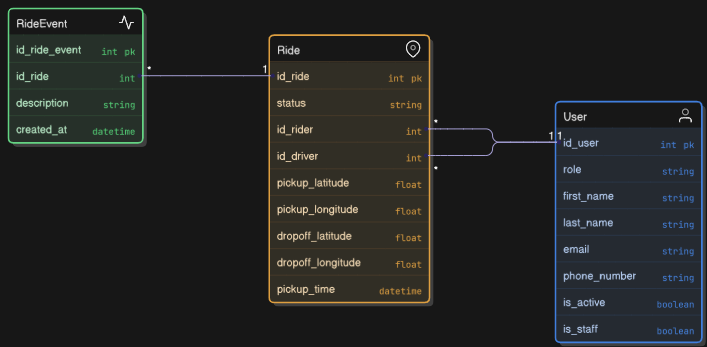

# Requirements 

- install docker desktop for windows

# Commands

- change the .env.prod based on your environment variables
- change the docker-compose file for the port you want to access the app (default 8001)
- run "- docker-compose -f docker-compose-.yml run --rm src sh -c "python manage.py createsuperuser"" to create super user to access admin
- run "docker-compose -f docker-compose.yml build" to build the project
- run "docker-compose -f docker-compose.yml up" and  open the project in localhost:8001

# URL
- http://localhost:8001/api/docs/ for endpoint documentation
- http://localhost:8001/aadmin for admin page (dont forget to create a superuser)

# Design Journey

## Starting Point: The Requirements
Given three entities (User, Ride, RideEvent) and strict performance requirements, I needed to build an efficient ride management API with admin-only access.

## Challenge 1: Audit Trail Without Complexity
### Problem: How to track all ride status changes without cluttering the main Ride table?

### Solution: Implemented event sourcing with Django signals

RideEvent table stores historical changes automatically
Signals capture status transitions without manual intervention
Clean separation between current state (Ride) and history (RideEvent)
No separate API endpoints needed - events are read-only and included in ride responses

## Challenge 2: The N+1 Query Monster
### Problem: Each ride API call threatened to execute hundreds of database queries (1 for rides + N for events + 2N for users).

### Solution: Aggressive query optimization

python
queryset = Ride.objects.select_related('id_rider', 'id_driver').prefetch_related('events')
Result: Just 3 queries regardless of dataset size.

# Challenge 3: Secure Admin-Only Access
### Problem: Requirements demanded only admins could access the ride API.

### Solution: Layered security approach

Token authentication for API access
Custom IsAdminRole permission checking user.role='admin'
Email-based authentication (modern pattern vs username)

## Challenge 4: Large Dataset Handling
### Problem: Anticipating thousands of rides with filtering/sorting needs.

### Solution: Built-in Django features

django-filter for status and email filtering
Ordering by pickup_time with sensible defaults
Pagination to prevent memory overload
The Result
An efficient, secure API that maintains complete audit trails while delivering responses in minimal database queries - meeting all performance requirements without sacrificing functionality.

# Bonus Feature: Long Trips Report

## SQL Implementation

-- Joins ride_event table twice to find pickup and dropoff timestamps
-- Calculates duration using SQLite's julianday function
-- Groups by month and driver for reporting

Location: utils.py contains the SQL query function
Access: Available through Django Admin interface as "Download Long Trips Report" button
Format: Exports as Excel file with formatting

Event-Based Duration Calculation: Uses RideEvent timestamps instead of adding duration fields to Ride table
Pattern Matching: Handles both initial creation events and status change events
Excel Export: Provides user-friendly formatted reports for non-technical users

